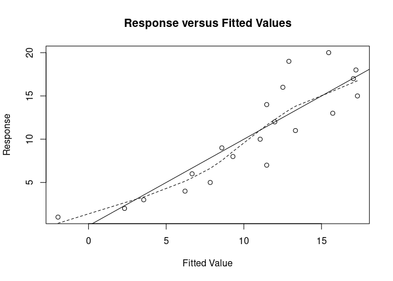
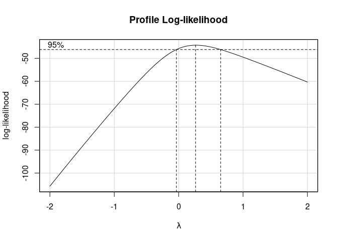
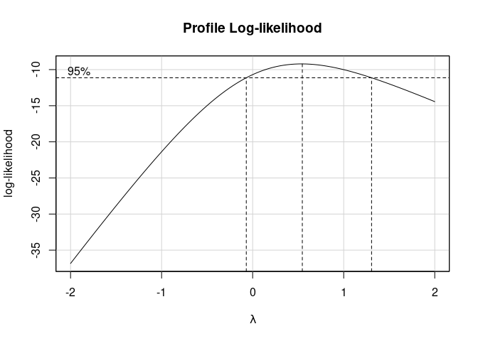
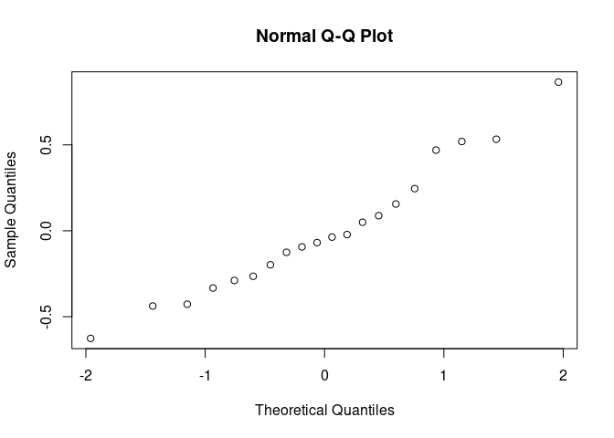
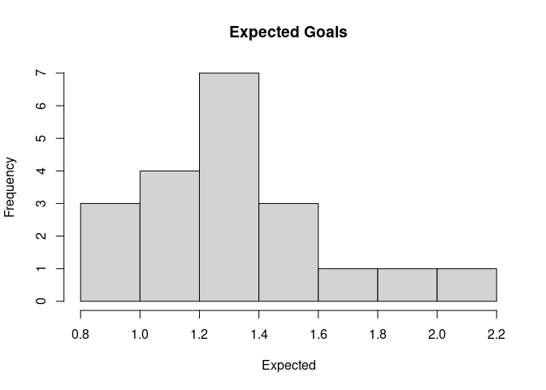
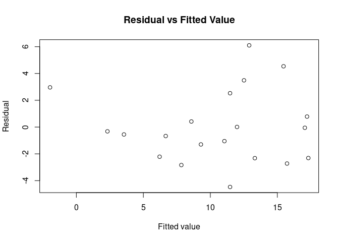
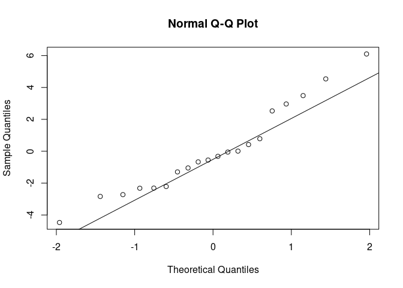

What Contributes to the Final League Position in the English Premier
League?
================
Sung Gyu Kang
December 17, 2022

## Introduction

As a long English Premier League fan, I became interested in finding out
what it takes for teams to become the league champion, and what teams
should be careful of when wishing not to be relegated from the league.
This research is very important, because there may be unexpected
underlying variables that influence the final league position for teams
at the end of the season.

For this research, because the goal is to find underlying factors which
could contribute towards the league position, obvious variables such as
goals scored for teams will not be considered. The variables that will
be looked into in this research are the league position at the end of
the season, the average possession teams have in league matches, the
average expected goals for teams, clean sheets, and goals conceded.

The final research question of this paper is to find out which model
best identifies the final league position for teams in the English
Premier League, so the variables we have chosen will be used to find the
best model and verify it. For the model, the multiple linear regression
model will be used.

The league position at the end of the season is obviously the most
important factor of this research, the average possession of teams in
league matches have been chosen as a variable because of the recent
style of play in soccer. Many strong teams in the English Premier League
have chosen to play and win by possessing the ball as much as they can,
so I thought it could be a key factor when deciding the league position.
The average expected goals is a relatively new term that has come up in
soccer, and is said to be important when winning matches. Expected goals
can basically tell us how the teams have played by estimating how likely
a team was to score based on the quality of its chances. It is different
from actually scoring a goal because it tells us the likelihood of how
which team actually should have scored in matches. The number of clean
sheets refers to games where teams have gone without allowing a goal so
it directly relates to the league position, and finally the goals
conceded also naturally relates to the league position so it was chosen
as well.

The English Premier league data was retrieved from “FootyStats” and the
specific season that I will be looking at is the 2018/2019 season.

Website: <https://footystats.org/download-stats-csv>

## Methods

In order to use the multiple linear regression model, some explanation
is needed. The multiple linear regression model is shown as
$$y = \beta_0 + \beta_1x_1 + \beta_2x_2 + \epsilon$$ where more
predictors can be added, but for this research only two will be used.

The $\beta_0$ is the intercept value of the regression line, $\beta_1$
is the change in $y$ with the change in $x_1$ with the assumption that
$x_2$ stays the same. The $\beta_2$ is also the change in $y$ with the
change in $x_2$ with the assumption that $x_2$ is the same. With
appropriate predictors, multiple linear regression can be used to model
the dependent variable $y$ using independent variables $x$. In the case
of our research, The $y$ is the final league position, and the $x$ is
the variables we have chosen.

To choose predictors for the final model, each separate variable was
scatter plotted with the final league position to look for strong linear
relations. Three of them showed linear relations which were average
possession, expected goals, and goals conceded. The two strongest
predictors, average possession and expected goals, were selected.

Now to check for our model we will need to go through a method called
the exploratory data analysis. By making a histogram of the two
predictor variables average possession and expected goals, we can check
the histogram and see if there are indications for violations. From the
histogram of expected goals as plot 1 in the appendix section, a right
skew can be seen which might indicate a violation.

Now to check for violations, we will use the residual plots. The
residual plots can measure the remaining variability so they can tell us
if there are violations. In the case of multiple predictors in the
model, we will have to check two conditions in order to look at the
residual plot and know how the model is violated.

To check if condition 2 holds, a scatterplot of the predictors can be
made and by looking at the relation, it can be seen that it is linear so
condition 2 holds.

To check if condition 1 holds, a plot of the response against the fitted
values can be made to determine the pattern of the plot. In this case
for condition 1 to hold the points need to be randomly scattered around
the g function. By looking at plot 2 in the appendix, it can be seen
that the points are randomly scattered around the g function so we can
say condition 1 holds as well.

**Plot 2: Response VS Fitted Values**

Now we can check the residual plots for possible violations. The
residual plots must show no discernible patterns. From looking at plot 3
in the appendix it shows a residual vs fitted value plot. From looking
at the plot and the plot of other predictors, it seems to show that
there are no violations and assumptions hold. By looking at the normal
QQ plot as plot 4 in the appendix section, however, the right end of the
tail seems to skew up so there might be a mild concern for normality
violation.

In order to fix this assumed violation of normality, we need to apply a
transformation to the response variable, and a square root
transformation seems to be appropriate in this cause. By looking at plot
5, the Box-Cox plot, the confidence interval does not capture the 1
value, so we will need to fix this by transforming the original model.

**Plot 5: Box-Cox Plot of Original Model**

## Results

As a result of the transformation as explained in the methods section,
the new final model have been made by square rooting and transforming
only the Y variable. From looking at plot 6, it can be seen that the new
confidence interval captures the 1 value in the Box-Cox plot. The new
normal QQ plot also shows that the points align more closely to the line
and the skew is less than the untransformed version.

**Plot 6: Box-Cox Plot of Transformed Model**

**Plot 7: Transformed Model Normal QQ Plot**

|                   | Adj R Squared | Average Possession p-value | Expected Goals p-value |
|-------------------|---------------|----------------------------|------------------------|
| Original Model    | 0.7636        | 0.111                      | 0.029                  |
| Transformed Model | 0.847         | 0.0266                     | 0.0107                 |

**Table 1: Numerical Summary of Original Model and Transformed Model**

By looking at the summary of the original model and the transformed
model, it can be seen that there are many positive changes. The original
regression coefficient value was 0.7636 which meant that the model could
only explain around 76% of the variability in the model. The transformed
model has a value of 0.847 which means it explains more variability. The
p-value from the anova test for the predictors also seem to have
positively changed where now, the p-value for the predictors have a
value less than 0.05 so it can be seen that both predictors are
important for the final model and the transformed model shows a much
stronger relation than the original model.

## Discussion

Now that the final transformed model have been made and confirmed as a
stronger model than the original one. From this model
$$y = \beta_0 + \beta_1x_1 + \beta_2x_2 + \epsilon$$ the y now has a
root over it, and from the summary the $\beta_0$ value is 7.83529,
$\beta_1$ value is -0.05208 and the $\beta_2$ value is -1.627728. This
means that with one unit increase in average possession, the square root
of the league position will decrease by 0.05208 when other predictors
remain fixed. In this case, the decrease in league position means lower
numbers so that would mean top teams in the league. With one unit
increase in expected goals, the league position to square root decreases
by 1.627728 with other predictors remaining fixed. When both predictors
are 0, the league position to square root would be 7.83529.

The final model seems to show relations and seems to be a good choice to
be the best model in predicting the final league position from the data
we have. Some of the limitations of this research are that the
transformation can never perfectly transform the model and this
limitation is acknowledged but considered acceptable given the model’s
overall improvement. While the model is not perfect, the transformation
improved both interpretability and statistical validity, making it a
strong candidate for predictive use. Overall, this analysis offers a
statistically sound and interpretable framework for understanding the
factors that contribute to team success in the English Premier League.

## Appendix

**Plot 1: Histogram for Expected Goals**

**Plot 3: Residual VS Fitted Value**

**Plot 4: Normal QQ Plot for Original Model**

## Bibliography

All analysis for this report was programmed using \`R Studio’

The packages dplyr, car, carData, openintro, forcats, lme4, purr, readr,
stringr, tibble, tidyr, tidyverse were used in this analysis.

Download Soccer / Football Stats Database to CSV: Footystats. Football
Stats by FootyStats. (n.d.). Retrieved December 17, 2021, from
<https://footystats.org/download-stats-csv>
